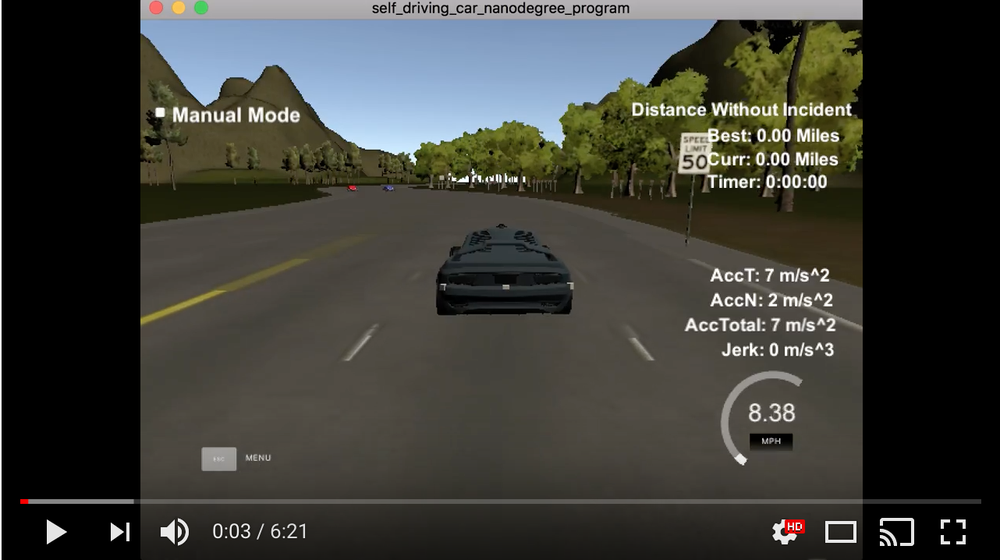

# CarND-Path-Planning-Project
Udacity Self-Driving Car Engineer Nanodegree Program, Term 3, Project 1

### Summary
In this project, I used a behavior planner and spline function in order to drive a car around a simulated track, including performing lane changes as necessary when around traffic.

The car is required to be able to drive at least 4.32 miles around the track without going over the speed limit, leaving the road, hitting other cars, spending too long between lanes, and exceeding certain acceleration and jerk thresholds.

### Detailed Implementation
I opted for a greedy approach in order to drive the car as optimally as possible. More exactly, I try to always keep the car on the lane with the most free space ahead. If that's not possible (i.e. there's heavy traffic ahead), then keep a safe, constant distance behind the front car until the coast is clear to accelerate once more, and change the lane.

My implementation heavily relies on the usage of a spline function, which fits a line to given points. After fitting the line, I then feed points along that line (with the distance between them depending on the vehicle's current velocity) back into the simulator.

In `main.cpp`, I first check whether there is any remaining path left (code line 247). If it is the first time around, this means I have to initiate my points with the car's current position, to later be used in the spline function (code lines 261-276). If there is a remaining path, this will get pushed back into the x and y coordinates to be fed the simulator again. Additionally, I calculate the x, y, yaw and velocity based off the end values of the remaining path, in order to have the behavior planner begin from the end of the old path (lines 278-294).

Next, in order to compute the best strategy, I need the s and d Frenet coordinates, that I get from the current x and y coordinates (line code 297).

In the path planner, I compute the current lane (code line 89 in `planner.cpp`), then I compute separate lists of vehicles for each lane. If the current lane is either 0 or 2 (the left-most or right-most lane), then I also compute a list of the vehicles on the furthest lane (this is for when the furthest lane is less busy than the current lane and it is worth checking if it is possible to prepare for that lane by getting on the middle lane first). I then compute the cost for each lane, as the sum of inverse values of the distances to the vehicles in front and behind (code line 55). Also, if the vehicle in the front is close (<20m apart), then I slow down to its speed, in order to keep a constant, safe distance (code lines 21-23). If the vehicle is very close(<10m, may be the case when a vehicle sharply changes lanes in front of me), then I slow down even harder, in order to avoid a collision (code lines 28-30). I also check that the distance to the vehicle behind be >5m.

Finally, I get the lane with the minimum cost (code lines 149-171). I also add a slight penalty to changing lanes, because it is more likely for an accident to occur when changing lanes.

Finally, the planner returns the target lane, speed, and distances to the car in the front and behind on that lane. In `main.cpp` I double check that taking the action suggested by the path planner is safe (code lines 308-319). If it isn't, then the vehicle keeps the current lane, and the target speed is reset to the old vehicle being followed.

Then, I equally space out the waypoints by a value directly proportional to the current velocity. These, along with any from the old path (or the car starting point if initializing) are then shifted and rotated so that they are local to my own vehicle (code lines 341-347), in order to ensure the spline works correctly, as the x-values need to be in order, and we want to the be correctly spaced out going forward. I then use the spline to come up with new points along that spline. For wach new point, I compare the current velocity to the target speed and either accelerate or deccelerate. These points are then rotated and shifted back to global coordinates, and fed to the simulator to drive (code lines 361-394).